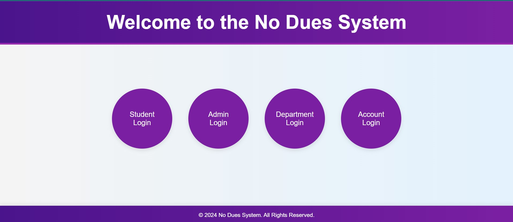

# No Due System



## Overview

The **No Due System** is a web-based application designed to streamline the process of tracking and managing the no dues clearance of students. This system ensures that students have cleared their dues across multiple departments before they can request a refund. The application provides four distinct panels for different user roles: Admin, Account, Department, and Student.


## Features

- **Admin Panel:**

  - Manage users and departments.
  - View system-wide statistics and reports.


- **Account Panel:**
  - View students' no due statuses.
  
  - Initiate refunds for students who have cleared all dues.


- **Department Panel:**

  - Review and update the no due status for students within the department.
  - Provide comments and approve or deny no dues clearance.


- **Student Panel:**

  - Submit no dues requests.
  - Upload required documents (e.g., canceled check for refunds).
  
  - Track the status of no dues clearance across all departments.
  


## Installation

### Prerequisites
- **XAMPP** or any LAMP/WAMP/MAMP stack.
- **PHP 7.4** or higher.
- **MySQL 5.7** or higher.

### Steps

1. **Clone the repository:**
   ```bash
   git clone https://github.com/VarshaSingh-343/noDueSystem.git

2. **Move the project folder:** 
    Move the project folder to your web server's root directory (e.g., htdocs for XAMPP).

3. **Create a database in MySQL and import the SQL file:**

    - CREATE DATABASE noduesproject;
    - USE noduesproject;
    - SOURCE noduesproject.sql;

3. **Start your web server and navigate to the application:** 
    Open your browser and go to: http://localhost/noduesproject

### Technologies Used

**Frontend:**
- Html
- CSS
- Javascript

**Backend:**
- PHP 

**Database:**
- MySQL

**Server:**
- Apache (via XAMPP)

### Contributing
Contributions are welcome! Please fork the repository and submit a pull request for any improvements or fixes.